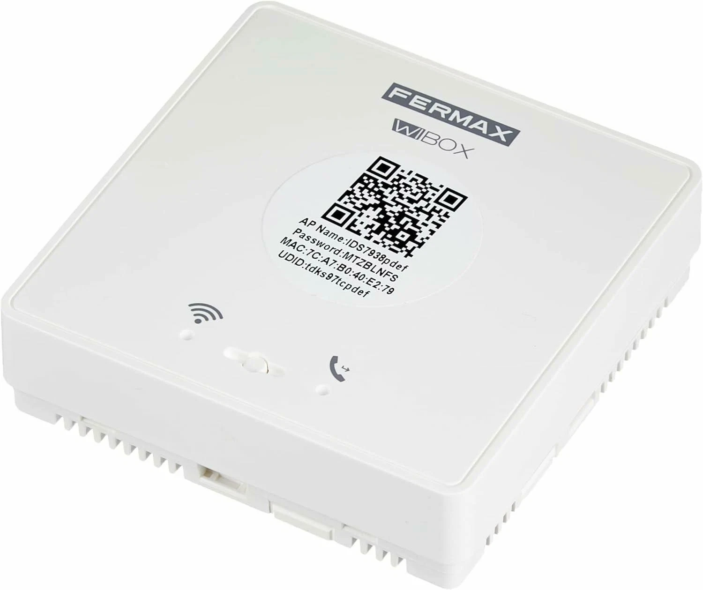
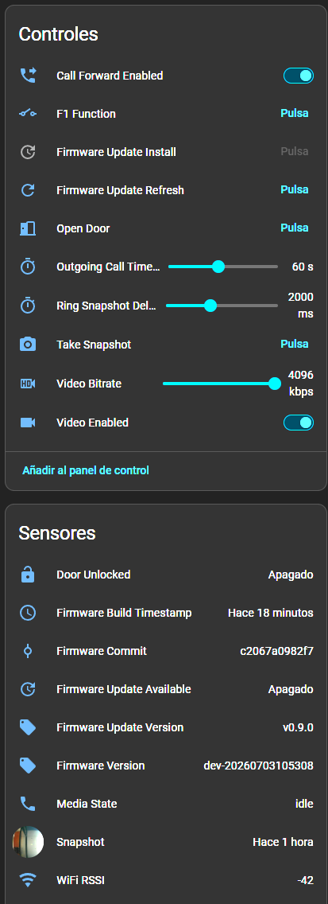

# 🏠 WiBox Media

**Custom firmware for the Fermax WiBox intercom module — so your door entry
phone answers on your phone, your tablet, and Home Assistant, with nobody
else's cloud in the middle.**



---

## 🤔 What is this, in plain words?

The **Fermax WiBox** is a small box an installer fits next to the intercom
monitor in your hallway. Out of the box it links your door entry system to
Fermax's phone app, through Fermax's servers.

This firmware **replaces the software inside that box**. Same hardware, same
wires, but afterwards the module talks to *your* home instead of a company's
cloud:

- 📹 you see who is at the door
- 🗣️ you talk to them
- 🚪 you open the door
- 🏡 all of it on your own network, and from outside if you set that up

Nothing leaves your house unless you make it. There is no account, no
subscription, and it keeps working if a company changes its mind.

> ⚠️ **This replaces the manufacturer's firmware.** Take the backups described
> in [Getting Started](docs/getting_started.md) first. You can go back — the
> original Fermax software is still on the device and there is a
> [factory mode](docs/getting_started.md) to boot it — but do the backups anyway.

---

## ✨ What you get

| | |
|---|---|
| 📹 **Video** | H.264 from the door camera, over RTSP |
| 🔊 **Two-way audio** | Hear the street and be heard back |
| 🚪 **Open the door** | From Home Assistant, from a SIP phone, or `#` on a call |
| 🔔 **Doorbell events** | A real notification when somebody rings |
| 📸 **Snapshots** | A picture of whoever rang, pushed to Home Assistant |
| 🏠 **Home Assistant** | Everything appears by itself over MQTT |
| ☎️ **SIP** | Works as a normal intercom against any SIP system |
| 🔄 **Updates** | Installed over the air from Home Assistant or a shell |
| 📊 **Metrics** | Prometheus, if you like graphs |

---

## 🧬 Where this comes from

This is a fork, and almost none of the hard groundwork is ours. The chain:

| Project | What it contributed |
|---|---|
| 🥇 [`duhow/wibox`](https://github.com/duhow/wibox) | First opened the device: firmware patching, installation and recovery |
| 🔊 [`Conclusio/wibox-audio`](https://github.com/Conclusio/wibox-audio) | Traced the audio hardware and built the audio bridge |
| 🧱 [`segator/wibox-media`](https://github.com/segator/wibox-media) | The SIP media daemon, Home Assistant integration and update system — the base this fork tracks |
| 🎴 [`cmos486/wibox-intercom-video-card`](https://github.com/cmos486/wibox-intercom-video-card) | The Home Assistant card that ties it together on screen |

**This fork** ([`cmos486/wibox-media`](https://github.com/cmos486/wibox-media))
adds two-way audio over WebRTC, the VDS bus work described below, health
monitoring, and a pile of fixes. The full list: **[About this fork](FORK.md)**.

---

## 🔬 What we figured out

A lot of this firmware exists because of things that were not documented
anywhere and had to be found by experiment, on a bench built from a **real
Fermax installation** — outdoor panel, original monitor and WiBox on the same
wires. The findings are written up properly, because they are the difference
between this working and this half-working:

- 🚪 **[The VDS bus, explained](docs/vds-bus.md)** — how Fermax's bus works, why
  the module needs an *address* and what happens when it is wrong (spoiler:
  absolutely nothing happens, silently), and how to set it without the pairing
  dance that does not work on every monitor.
- 🤝 **[Sharing the bus with the original intercom](docs/coexistence.md)** — can
  this break the intercom the rest of the household uses? Tested properly, with
  the logs kept. Short answer: no, and the reason is reassuring.
- 📻 **[UART codes](docs/codes.md)** — the complete command set the stock
  firmware uses to talk to Fermax's microcontroller, recovered by disassembling
  it, checksum and all.

---

## 🚀 Getting it running

### Step 1 — Read before you flash 📖

**[Getting Started](docs/getting_started.md)** covers access, backups, the first
flash and the first boot. Do not skip the backups.

Which stock versions are known to work:

| Stock firmware | Access |
|---|---|
| `V500.R001.A103.00.G0021.B007` | ✅ telnet |
| `V500.R001.A103.00.G0021.B010` | ✅ telnet |
| `V500.R001.A103.00.G0021.B013` | 🔌 serial only (telnet blocked) |

Treat anything newer as serial-only until somebody proves otherwise.

### Step 2 — Get the firmware 💾

```bash
VERSION="v0.18.14"
wget -O wibox-media.img \
  "https://github.com/cmos486/wibox-media/releases/download/${VERSION}/wibox-media-${VERSION}.img"
```

> 💡 Run that **on your computer**, not on the WiBox. The stock device's `wget`
> cannot fetch GitHub's HTTPS downloads. Transfer the file across afterwards —
> Getting Started shows how with `nc`.

You do not need to build anything from source unless you are changing the code.

### Step 3 — Connect it to WiFi 📶

After the first flash the module raises its own WiFi network called
`IDS7938XXXX` (the Device ID is printed on the label). Join it and open
**`http://192.168.111.1/`** to enter your network details. No cable needed.

To move it to a different network later, **hold the WiFi button for 5 seconds**.
A blinking blue LED means the setup page is up again.

### Step 4 — Configure it ⚙️

Settings live in one file on the device:

```text
/mnt/mtd/sip_media.conf
```

For most installations only a handful of lines matter:

```ini
mqtt_host=192.168.0.203        # your Home Assistant / MQTT broker
mqtt_user=wibox
mqtt_pass=change-me
rtsp_enabled=1                 # turn on the video stream
video_enabled=1
```

Everything else, with defaults: **[Runtime configuration](docs/sip_media.md)**.

### Step 5 — Add it to Home Assistant 🏠

If MQTT discovery is on, the device appears by itself. Nothing to write by hand.



### Step 6 — Tell it which flat it is 🚪

**This is the step people miss, and it is the one that breaks doorbells.** The
module has to know which flat it is copying, or street calls will never reach it
and nothing will tell you why.

Clear the old address with **five short presses of PB2**, then type the number
into the **VDS Address** entity in Home Assistant. Full explanation and how to
check it: **[The VDS bus](docs/vds-bus.md)**.

---

## 🎴 The Home Assistant card

For an actual "somebody is at the door" experience — the video, a talk button
and a door button, working on phones and wall tablets, at home and away — pair
this firmware with the companion card:

👉 **[`wibox-intercom-video-card`](https://github.com/cmos486/wibox-intercom-video-card)**


Setting it up end to end (go2rtc, WebRTC, remote access, talk-back):
**[Home Assistant two-way audio](docs/homeassistant-two-way-audio.md)**.

---

## 🔌 When you need the serial cable

Sooner or later you will want a **USB-to-TTL adapter**. It is how you get in
when telnet is blocked, and how you rescue a device that will not boot. It costs
very little and it is the difference between a bad afternoon and a dead module.

> ⚡ **Use a 3.3 V adapter.** A 5 V one can damage the board. Check the jumper
> before you plug anything in.

Three wires, and **TX goes to RX**:

| WiBox board | USB-TTL adapter |
|---|---|
| GND | GND |
| TX | **RX** |
| RX | **TX** |

Then, at `115200` baud:

```bash
picocom -b 115200 /dev/ttyUSB0
```

Where the pads are, with photos, and how to catch the bootloader:
**[Serial TTL](docs/serial_ttl.md)**. If the device will not start at all:
**[Recovery](docs/recovery.md)**.

---

## 🩺 Keeping it healthy

The module is meant to be installed and forgotten, possibly in somebody else's
house, so it looks after itself:

- 🔁 **Watchdog** — if the daemon dies it is restarted
- 👂 **Audio self-healing** — a capture that goes silent is detected and restarted
- 📅 **Scheduled reboot** — optional, off by default, set the hour from Home Assistant
- 🕐 **Correct clock** — synchronised at boot, with your timezone
- 🚦 **Health entities** — `Health` and `Health Detail` in Home Assistant say what is wrong

Updates install over the air from Home Assistant, and the **VDS address survives
them** *(verified — the module was updated with its pairing intact)*, so you do
not need to visit the installation to update it.

---

## 🆘 Something is wrong

| Symptom | Look here |
|---|---|
| 🔕 Nobody rings when the street button is pressed | [VDS address](docs/vds-bus.md#-the-address-is-everything) — almost always this |
| 🔵 Blue screen instead of the camera | [The bus is not opened](docs/vds-bus.md#-why-audio-and-video-need-the-bus-opened) |
| 🔇 Video works, audio is a faint hiss | Same page, same cause |
| 🙊 They cannot hear you | [Two-way audio guide](docs/homeassistant-two-way-audio.md) |
| 📵 The doorbell goes busy sometimes | [Sharing the bus](docs/coexistence.md) |
| 🧱 Will not boot | [Recovery](docs/recovery.md) + [Serial TTL](docs/serial_ttl.md) |

---

## 📚 All the documentation

**Installing and running**
- [Getting Started](docs/getting_started.md) — stock device to custom firmware
- [Serial TTL](docs/serial_ttl.md) — wiring and bootloader access
- [Recovery](docs/recovery.md) — when things go wrong
- [Firmware Updates](docs/updates.md) — over the air and from a terminal
- [Runtime configuration](docs/sip_media.md) — every setting, SIP, MQTT, metrics

**Home Assistant**
- [Two-way audio](docs/homeassistant-two-way-audio.md) — see, talk, open, from anywhere

**The Fermax side**
- [The VDS bus, explained](docs/vds-bus.md) — addresses, pairing, auto switch-on
- [Sharing the bus](docs/coexistence.md) — living with the original monitor
- [UART codes](docs/codes.md) — the frame reference

**Inside**
- [Architecture](docs/architecture.md) — boot and runtime layout
- [Hardware reference](docs/system.md) — flash layout, serial devices
- [D1 video capture](docs/d1_video_capture.md) — low-level capture notes
- [Hardware resilience](docs/hardware_resilience.md) — watchdogs and recovery
- [About this fork](FORK.md) — what is added on top of upstream, and why

**Contributing**
- [Development](docs/development.md) — building and releasing
- [Security](SECURITY.md) — RTSP, SSH and MQTT hardening

Raw reverse-engineering notes live in `research/`. You do not need them to
install anything.

---

## 🛠️ Building from source

Only if you are changing the firmware.

```bash
make docker     # build the toolchain image
make build      # build the firmware
make verify     # check the result
```

Handy during development:

```bash
make build-media       # rebuild just the daemon and the updater
make deploy-runtime    # push the daemon to a running WiBox (volatile — lost on reboot)
make verify-device     # check runtime + MQTT against a live device
make device-status     # status and recent logs
```

> ⚠️ `make deploy-runtime` is for testing only. It does **not** survive a reboot
> — install a real release if you want the change to stick.

Details in [Development](docs/development.md) and [About this fork](FORK.md).
